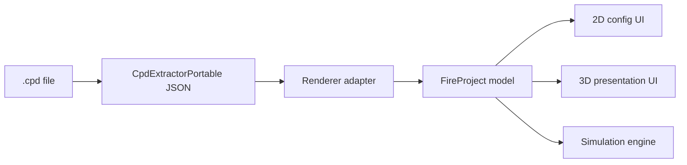

# CPD Logic And 3D Presentation Design

Date: 2026-05-23

## Purpose

This design extends `Numens Fire Alarm Simulator` after the initial CPD-driven rewrite. The goal is to close the remaining gap between real `.cpd` configuration semantics and the application's model, simulation and 3D presentation. It also separates 2D configuration work from 3D presentation/simulation work so the user does not see mixed modes.

## Confirmed Decisions

- The real acceptance sample is `D:\Users\30741\Desktop\程序开发\报警模拟器\Exam_6002_Answer_Advanced.cpd`.
- Missing CPD logic is treated as a pipeline problem, not just a visual issue.
- The application must audit all similar relation losses, including:
  - Zone to Sounder Group and I/O Group cause/effect links;
  - Sounder Group and I/O Group member tables;
  - device Zone, Sounder Group and I/O Group assignments;
  - disabled, inhibit, delay and override flags;
  - parsed raw fields that are currently not normalized or consumed.
- Engineering/config relations must be visible, highlightable and locatable.
- Real cause/effect relations must also affect simulation behavior.
- 2D is configuration only.
- 3D is presentation and simulation.
- 3D drawing opacity must support global opacity and per-floor override.
- Zone visual areas are saved project drawings. If none exist, 3D may render a temporary bounding area from placed devices, but must not persist it.
- Building/Floor presentation isolates selected scope; relation presentation highlights/dims instead of hiding context. Cross-floor relation endpoints remain visible when needed.

## CPD Relationship Pipeline

The implementation treats CPD import as a four-layer pipeline:

Each relation loss must be assigned to exactly one failing layer:

- `extractor-missing`: the extractor JSON does not expose a required CPD field.
- `adapter-missing`: extractor JSON contains the field, but `cpdAdapter.ts` drops or mis-maps it.
- `model-unused`: the model stores raw fields but lacks explicit relation metadata.
- `ui-unused`: the model has the relation, but 3D filtering/highlighting or summary UI does not expose it.
- `simulation-unused`: the model has a cause/effect relation, but simulation does not consume it.

## Normalized Relation Model

The model needs explicit, traceable relation information while preserving existing typed fields.

Required relation categories:

- Device assignment:
  - device belongs to Zone;
  - device belongs to Sounder Group;
  - device belongs to I/O Group;
  - device has disable/inhibit/delay flags.
- Zone cause/effect:
  - alarm 1 and alarm 2 Sounder Group links;
  - alarm 1 and alarm 2 I/O Group links;
  - delayed sounder flag;
  - single/double alarm mode.
- Group membership:
  - Sounder Group addressable members by loop/address;
  - Sounder Group non-addressable members where present;
  - I/O Group members by loop/address;
  - raw source fields for audit traceability.

The adapter may continue to synthesize missing groups from device assignments, but synthesized data must be distinguishable from CPD-authored group tables by `raw` metadata.

## 3D Presentation Controls

3D toolbar controls:

- Drawing opacity:
  - global opacity slider;
  - optional per-floor override selector/slider.
- Scope filters:
  - all;
  - selected Building;
  - selected Floor;
  - selected Device Type.
- Highlight targets:
  - Loop;
  - Zone;
  - Sounder Group;
  - I/O Group.

Device Tree/right panel interactions can set 3D highlight targets for Loop, Zone, Sounder Group, I/O Group and single device.

Behavior:

- Building/Floor scopes hide unrelated floors/devices, except required relation endpoints.
- Loop/Zone/Group/Type/Device targets dim unrelated devices and lines.
- Highlighted devices keep full opacity and use a clear highlight color.
- Unrelated devices dim consistently.
- Loop lines follow the same target filtering/dimming rules.

## Zone Area Highlighting

Zone area rendering order:

1. If a Zone has saved `visualAreas`, render those areas in 3D.
2. If no saved area exists, compute a temporary bounding polygon from placed devices in the selected Zone on each floor.
3. If the Zone has no placed devices, show only device/group highlight state and no temporary area.

Temporary bounds:

- are generated at render time;
- use floor/building/device positions;
- include padding so the area is visibly larger than the device cluster;
- are never written back to `project.networks[].panels[].zones[].visualAreas`.

## 2D Configuration Boundary

2D must not expose runtime simulation behavior:

- no Simulation Mode control;
- no double-click alarm activation/restoration;
- no context menu actions for start alarm, restore input, trigger fault or restore fault;
- no runtime alarm/fault/output flashing classes.

2D may still show static configuration information:

- disabled device opacity or badge;
- inhibited or missing indicators if already modeled;
- selected device styling;
- placement, Zone drawing and loop wiring UI.

The right panel may continue to exist in 2D, but the simulation tab must not be presented as part of the 2D workflow.

## Simulation Boundary

Simulation remains available from 3D. It must consume completed CPD cause/effect relations:

- manual EVACUATE still activates enabled sounder-class outputs;
- normal input alarms follow Zone/group/device CPD logic;
- delays and override flags apply according to normalized fields;
- disabled outputs remain inactive;
- inhibited sounders/I/O/relays suppress the matching output classes.

## Acceptance Criteria

- Importing or auditing `Exam_6002_Answer_Advanced.cpd` produces a relation count report.
- The report identifies fixed relation categories and any remaining unsupported CPD fields.
- 3D supports drawing opacity control with global and per-floor behavior.
- 3D can focus Building, Floor, Device Type, Loop, Zone, Sounder Group, I/O Group and single device.
- 3D Zone selection renders a saved or temporary region highlight.
- 2D has no runtime simulation actions or visual simulation states.
- Tests cover CPD relation audit, adapter mapping, 3D filtering/highlighting, Zone temporary bounds, 2D config-only behavior and simulation relation consumption.
- `npm run lint`, `npm run typecheck`, `npm run test` and `npm run build` pass, or any failure is documented with scope and cause.
