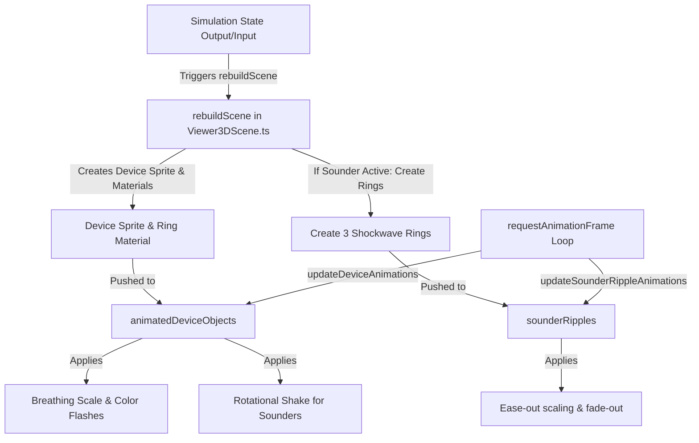

# 3D Device Activation Animations Design Specification

This document details the technical implementation plan for adding dynamic activation animations to devices, sounders, and Input/Output (IO) modules in the 3D Viewer of the Fire Alarm Simulator. These animations mimic the premium visual feedback of the 2D "Rapid Response" page inside a 3D WebGL (Three.js) environment.

## Goal Description

Enhance the simulator's 3D view to visually reflect active alarm states through smooth animations:
- **Detectors**: Breathing scale animation and red glowing/pulsing effect.
- **Sounders**: Rapid rotational shake (wiggle) and concentric ease-out red shockwave ripples.
- **IO Modules**: Blue or red breathing scale and pulsing colors depending on whether input or output is activated.

All animations will be driven by the existing requestAnimationFrame render loop in `Viewer3DSceneAnimation.ts`.

## Proposed Changes

We will implement the changes within the submodule: `Numens Fire Alarm Simulator`.

### Component Diagram & Flow



---

### Component changes

#### [MODIFY] [viewer3DSimulationVisual.ts](file:///d:/Users/30741/Desktop/程序开发/报警模拟器/Numens Fire Alarm Simulator/src/renderer/src/domain/fire/viewer3DSimulationVisual.ts)
Update `Viewer3DDeviceAnimationInput` and the `getViewer3DDeviceAnimationFrame` function to support input active states and IO module states.

- Add fields to `Viewer3DDeviceAnimationInput`:
  ```typescript
  inputActive: boolean
  isIO: boolean
  ```
- Update animation frame calculation logic for input active and IO states:
  - If a detector/input device has an active input (`inputActive === true && !isIO`):
    - Color: `#dc2626` (Red)
    - Scale: Oscillate scale via sine wave between `1.0` and `1.2` of base size.
    - Ring Opacity: Breathe between `0.55` and `0.89`.
  - If an IO module (`isIO === true`):
    - Scale: Oscillate scale via sine wave between `1.0` and `1.2` of base size.
    - Color: If input is active (`inputActive`), color is `#dc2626` (Red). If output is active (`outputState === 'active'`), color is `#2563eb` (Blue).
    - Ring Opacity: Breathe between `0.55` and `0.89`.

#### [MODIFY] [Viewer3DSceneAnimation.ts](file:///d:/Users/30741/Desktop/程序开发/报警模拟器/Numens Fire Alarm Simulator/src/renderer/src/components/fire/Viewer3DSceneAnimation.ts)
Update the animation runner to rotate wiggling sounders and update the shockwave ripple meshes.

- Add `sounderRipples` to `Viewer3DSceneAnimationDependencies` and the return signature of `createViewer3DSceneAnimation`.
- Update `updateDeviceAnimations` to rotate active sounders:
  ```typescript
  if (object.isSounder && object.outputState === 'active') {
    object.spriteMaterial.rotation = Math.sin(elapsedMs * 0.04) * 0.08;
  } else {
    object.spriteMaterial.rotation = 0;
  }
  ```
- Implement `updateSounderRippleAnimations(deltaMs)`:
  - Stagger shockwaves with initial progresses `0`, `0.33`, and `0.66`.
  - Progress increment: `deltaMs / 600`.
  - Interpolation curve: quadratic ease-out `easeOut = 1.0 - Math.pow(1.0 - progress, 2)`.
  - Scale: `0.8 + easeOut * 2.7`.
  - Opacity: `0.8 * (1.0 - easeOut)`.

#### [MODIFY] [Viewer3DScene.ts](file:///d:/Users/30741/Desktop/程序开发/报警模拟器/Numens Fire Alarm Simulator/src/renderer/src/components/fire/Viewer3DScene.ts)
Update the scene builder to instantiate animated objects and shockwaves.

- Expand the `AnimatedDeviceObject` interface to include `inputActive` and `isIO`.
- In `rebuildScene()`, declare and clean up a `sounderRipples` collection.
- In `renderDevice()`:
  - Detect if device is input active (`hasActiveInput(device.id)`).
  - Detect if device is an IO (`device.type === 'input_output' || device.type === 'wireless_input_output'`).
  - If a device needs animation (`inputActive || (outputState !== null && !isDelayedSounder)`), push it to `animatedDeviceObjects`.
  - If a device is an active sounder (`device.isSounder && outputState?.state === 'active'`), create 3 concentric `RingGeometry` meshes with staggered progresses, add them to the scene, and register them in `sounderRipples`.

---

## Verification Plan

### Automated Tests
- Run existing unit tests inside `Numens Fire Alarm Simulator` to ensure no regressions.
  - Command: `npm run test` or specific domain test suites.

### Manual Verification
1. Start the Electron development server.
2. In the 3D View:
   - **Trigger a Detector (e.g. Optical Detector)**: Confirm it scales up and down (breathes) and glows/flashes red.
   - **Trigger a Sounder**: Confirm the icon wiggles back and forth, and red shockwave circles radiate outwards from its base.
   - **Trigger an IO Module Input**: Confirm it breathes and flashes red.
   - **Trigger an IO Module Output**: Confirm it breathes and flashes blue.
3. Reset/Silence the alarm and verify all visual effects are correctly cleaned up and disposed of from the 3D scene.
